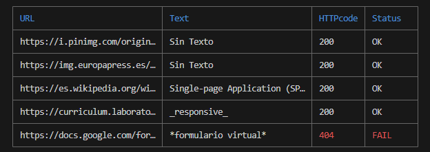
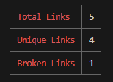
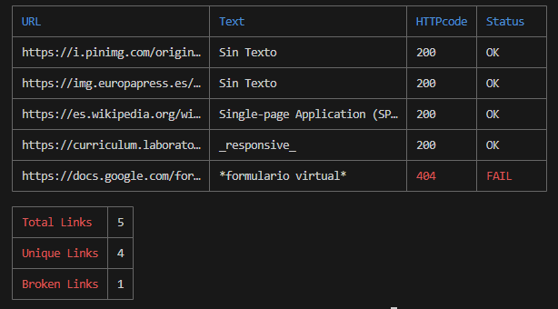

# Markdown Links

## Índice

* [1. introduction](#1-introduction)
* [2. Summary](#2-summary)
* [3. Flow diagram used to develop the project](#3-flow-diagram-used-to-develop-the-project)
* [4. How to use](#4-how-to-use)
* [5. General considerations](#5-general-considerations)
* [6. Contributing](#6-contributing)
* [7. license](#7-license)

***

## 1. Introduction

An API (Application Programming Interface) is a set of rules and protocols that allow different applications to communicate with each other. In simple terms, an API acts as a bridge that allows two programs or systems to exchange information and perform actions in a coordinated manner.

On the other hand, Markdown files are plain text files that use a simple and readable syntax to format the content. They are widely used to create documentation, blogs, web pages, and more. One of Markdown's outstanding features is its ability to include links to other web pages, resources, or files within the text.

Links in Markdown Files
Markdown files can contain links to websites, online resources, or even to other parts of the same document. Links are created using the syntax [link text](link url).

For example:

## 2. Summary

The Markdown Link Validator serves as a powerful tool streamlining the intricate process of link validation within Markdown files. In the realm of content management, links can often succumb to obsolescence, inaccuracies, or outright breakages, impeding the seamless navigation through content. The purpose of this tool is to confront this issue head-on.

Operating through an API, the system meticulously combs through designated Markdown files, meticulously isolating every embedded link. The mechanism orchestrates this operation by first specifying the targeted path through issued commands. Subsequently, it meticulously verifies the path's existence, classifying it as either relative or absolute. Furthermore, the system ascertains whether the path refers to a file or a directory. In instances where the path points to a directory housing additional subdirectories, the function initiates recursive calls, ensuring that every file within the pathway undergoes thorough scrutiny. Once the link extraction process concludes, the tool shifts its focus to assessing the links' authenticity. It meticulously evaluates each link's functional status, scrutinizing whether it maintains its connection and guides users to the desired destination. This facet of the tool proves especially invaluable in extensive documents housing an array of hyperlinks, obviating the need for manual link-by-link assessments.

Upon completion, the tool furnishes a comprehensive report. This report encompasses the link itself, the accompanying text, the HTTP response code, and the current state—labeled as "ok" in the event of operational success or "fail" in the event of a malfunction. This robust system aims to offer a comprehensive solution to the challenge of maintaining functional links within the dynamic landscape of Markdown files.

## 3. Flow diagram used to develop the project

## 4. How to use

To use the Markdown Links Validator, you'll need **Node.js** installed. Then, follow these steps:

1. Open your terminal.
2. Install the tool globally using npm:

`npm install markdown-link-validator-api`

3. Let's say you have a file named app.js that contains the code to use the Markdown Link Validator API. Additionally, you have a folder named testing-files containing Markdown files that you want to validate. To perform the validation and obtain statistics about the links, you should run the following commands in your terminal:

**path**: Argument that indicates the tool the path of the file you want to check. This path can be relative or absolute.

options: Argument that allows you to specify certain features to evaluate:

**--validate**: The module will make an HTTP request to check if the link works or not.

**--stats**: If we pass the --stats option, the output will be a text with basic statistics about the links, including the total number of links and the total number of unique links.

**--validate --stats**: It will deliver comprehensive statistics that also include "broken" links, which are links that are not working or invalid. It also works reverting the commands order(**--stats --validate**).

`node app.js ./testing-files --validate --stats`

### Results 

Depending on the selected commands, the API can return a table containing the information extracted through the HTTP request:

 

A table with basic statistics about the found links (a count of operational links, broken links, and a total):

 

As well as two tables including all the aforementioned information:

## 5. General considerations 

This project has been meticulously crafted for seamless usage within a Node.js environment, harnessing a set of essential tools and libraries to enhance its functionality and user experience:

### Node.js Environment
The Markdown Links Validator has been designed to operate smoothly within the Node.js runtime environment. Node.js offers a robust platform for building server-side applications and tools, making it a suitable foundation for the Markdown Links Validator.

### Dependencies and Libraries
The following tools and libraries have been integrated into the Markdown Links Validator to facilitate its operations:

**colors**: This library brings a vibrant spectrum of colors to terminal text output. By enhancing the readability of messages and reports, it ensures a more engaging and visually informative experience.

**cli-table**: The cli-table tool empowers the Markdown Links Validator to generate clean and neatly formatted ASCII tables directly within the command line interface. This feature enhances the presentation of link validation results and statistics.

**markdown-link-extractor**: Operating as a library, markdown-link-extractor excels at extracting links embedded within Markdown files. By integrating this tool, the Markdown Links Validator effortlessly gathers the link data required for validation.

**axios**: The axios library serves as a reliable tool for making HTTP requests. By employing axios, the Markdown Links Validator efficiently validates the status of each link, determining whether they are functional or broken.

## 6. Contributing

Contributions are always welcome! If you identify issues, have enhancement suggestions, or want to contribute to the project, please open an issue on this GitHub repository. I greatly value your input and efforts.

## 7. License

This project is under LABORATORIA license. 
